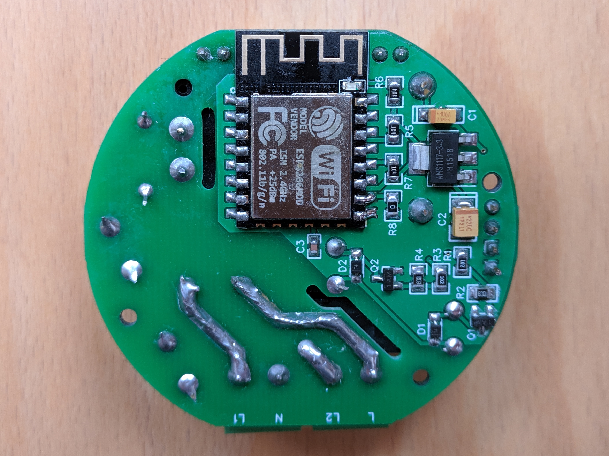

# OpenIoTSwitch

The OpenIoTSwitch is yet another diy smart light switch based on the ESP8266 featuring up to two relays. It is meant to be installed behind a standard (1 or 2 gang) light switch. The physical light switch will still be functional as well as wireless control via the tasmota firmware.

## PCB

The PCB design can be found on [EasyEDA](https://easyeda.com/kranwasser/openiotswitch) and can be ordered quite cheaply on JLCPCB. The Gerber file can be found in the releases section. In case you only need one relay just leave out the second one and configure the tasmota firmware accordingly.

## Parts list

|           Item          |  Location  |    Link    | Required |
|:-----------------------:|:----------:|:----------:|:--------:|
|         ESP-12F         |     U7     | [AliExpress](https://www.aliexpress.com/item/32339917567.html) |     1    |
|        0.5A fuse        |     U6     | [AliExpress](https://www.aliexpress.com/item/4000396818586.html) |     1    |
|   5x20mm fuse holder    |            | [AliExpress](https://www.aliexpress.com/item/32804593991.html) |     2    |
|        WJ126R 2P        |   U3, U5   | [AliExpress](https://www.aliexpress.com/item/32897358721.html) |     2    |
|       HLK-PM01 5V       |     U4     | [AliExpress](https://www.aliexpress.com/item/32705471039.html) |     1    |
|       AMS1117-3.3       |     U1     | [AliExpress](https://www.aliexpress.com/item/32844980545.html) |     1    |
|       MOV-07D271K       |     RV1    | [AliExpress](https://www.aliexpress.com/item/32847435105.html) |     1    |
|    0Ohm 0805 resistor   |     R8     | [AliExpress](https://www.aliexpress.com/item/32858225842.html) |     1    |
|   10kOhm 0805 resistor  | R5, R6, R7 | [AliExpress](https://www.aliexpress.com/item/32858225842.html) |     3    |
|  100kOhm 0805 resistor  |   R2, R4   | [AliExpress](https://www.aliexpress.com/item/32858225842.html) |     2    |
|   1kOhm 0805 resistor   |   R1, R3   | [AliExpress](https://www.aliexpress.com/item/32858225842.html) |     2    |
|   MMBT3904 transistor   |   Q1, Q2   | [AliExpress](https://www.aliexpress.com/item/32840835639.html) |     2    |
|    1x4 female header    |     P1     | [AliExpress](https://www.aliexpress.com/item/32858478594.html) |     1    |
|   G5NB-1A-E-DC5V relay  |   J1, J2   | [AliExpress](https://www.aliexpress.com/item/32888982845.html) |     2    |
|  1N4148W SOD-123 diode  |   D1, D2   | [AliExpress](https://www.aliexpress.com/item/32868523818.html) |     2    |
| 100nF ceramic capacitor |     C3     | [AliExpress](https://www.aliexpress.com/item/32853487845.html) |     1    |
| 22uF tantalum capacitor |     C2     | [AliExpress](https://www.aliexpress.com/item/32844177755.html) |     1    |
| 10uF tantalum capacitor |     C1     | [AliExpress](https://www.aliexpress.com/item/32846663127.html) |     1    |

## Setup

To flash the tasmota firmware consult the [tasmota wiki](https://github.com/arendst/Tasmota/wiki). All the needed pins are broken out on the OpenIoTSwitch board. Afterwards set up the module according to the following screenshot:

## Case

There is a 3D-printable case, however I did not get around to actually printing it yet so it is untested. Feel free to print the .blend-file and give your feedback.

## Disclaimer

:warning: **DANGER OF ELECTROCUTION** :warning:

If your device connects to mains electricity (AC power) there is danger of electrocution if not installed properly. If you don't know how to install it, please call an electrician (***Beware:*** certain countries prohibit installation without a licensed electrician present). Remember: _**SAFETY FIRST**_. It is not worth the risk to yourself, your family and your home if you don't know exactly what you are doing. Never tinker or try to flash a device using the serial programming interface while it is connected to MAINS ELECTRICITY (AC power).

I don't take any responsibility nor liability for using this module nor for the installation or any tips, advice, videos, etc. given by any member of this site or any related site.